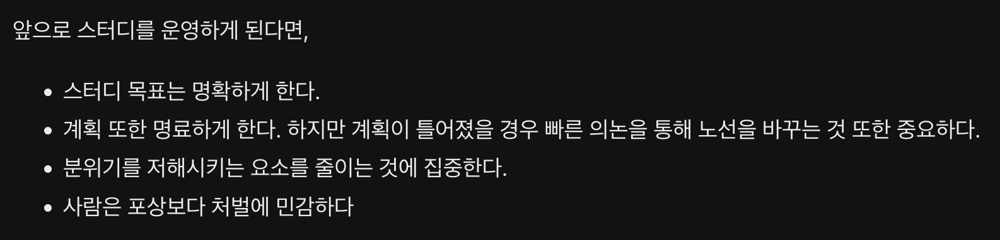
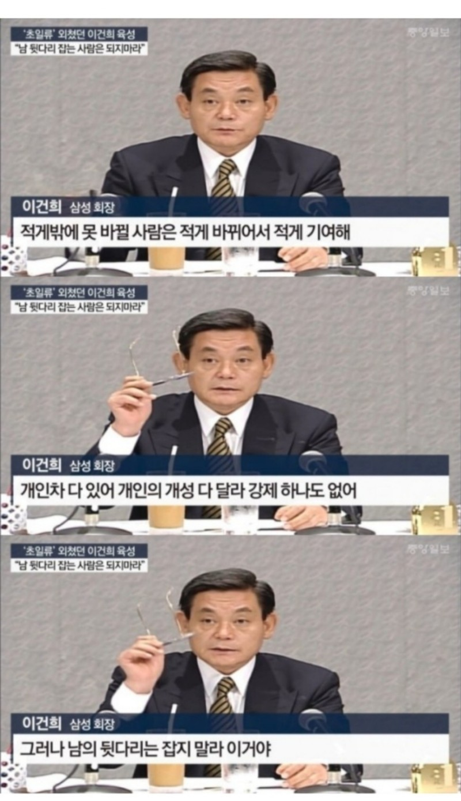
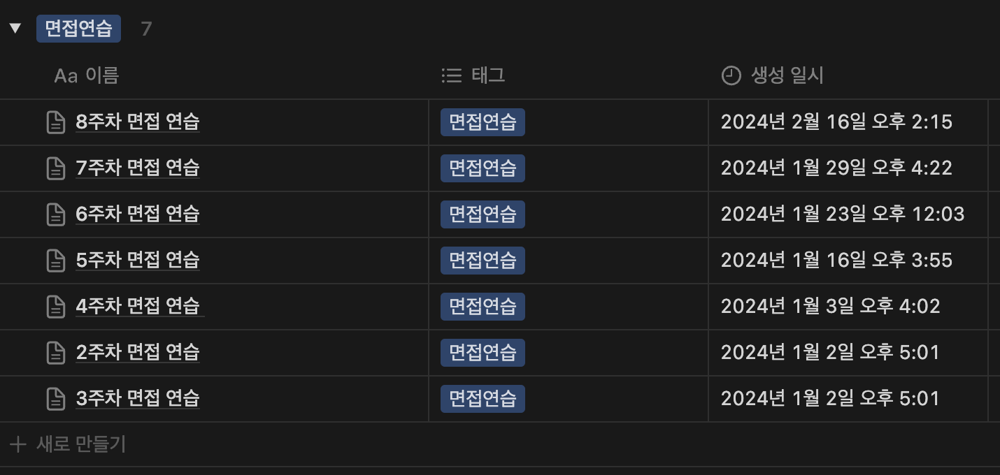
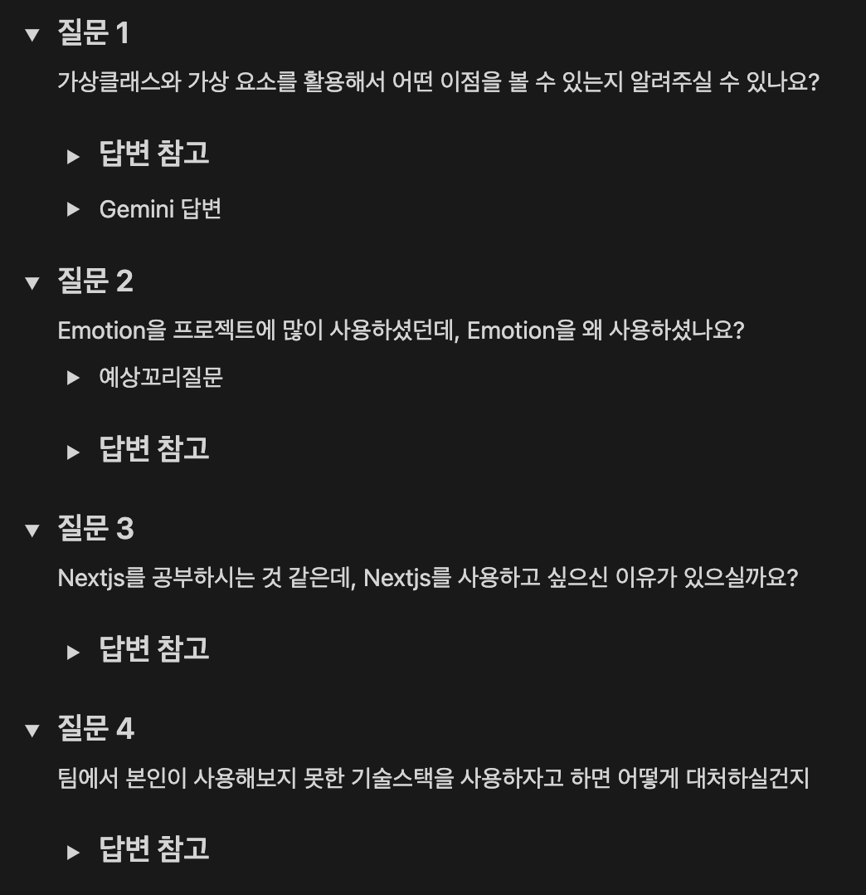
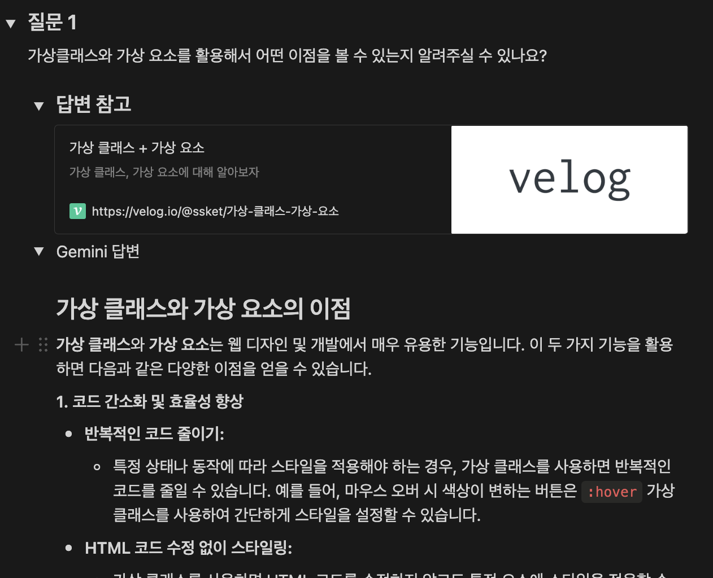
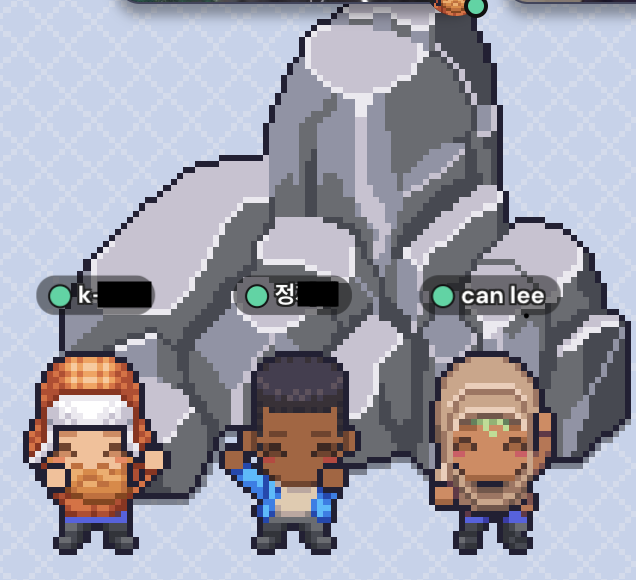

## Contents

# 데브코스가 끝나고...

작년 12월을 기점으로 6개월간의 데브코스 교육과정이 끝이 나게 되었습니다.

끝나고 나니까 후련하다기 보다는 교육 매니저님이 말씀하셨던 차가운 사회에 던져지는 느낌이 온몸으로 체감이 되었는데요.

과연 내가 스스로 환경을 잘 조성해서 앞으로의 학습을 잘 이어나갈 수 있을지에 대한 고민을 많이 하게 된 것 같습니다.

무엇을 할 지 감이 잡히지 않았고 결국에 제가 다시 믿어본 방법은 사람이었습니다.

> [함께자라기 독후감 링크](https://velog.io/@busybusyworld/%ED%95%A8%EA%BB%98%EC%9E%90%EB%9D%BC%EA%B8%B0-%EB%8F%85%ED%9B%84%EA%B0%90)

시작은 스터디가 아니고 코어타임만 같이 공부하는 식의 일종의 모임이었지만, 참여할 인원들이 어느정도 모이고, 앞으로의 방향성에 대해 이야기 해본 결과 스터디를 운영하게 되었습니다.

# 스터디가 성공하기 위해서는 무엇이 필요할까?

스터디가 성공하기 위해 데브코스에서 운영해보았던 스터디 경험을 복기해봤습니다.

> [해당 회고 글 링크](https://velog.io/@busybusyworld/2023%EB%85%84-7%EC%9B%94-%ED%9A%8C%EA%B3%A0-in-%ED%94%84%EB%A1%A0%ED%8A%B8-%EC%97%94%EB%93%9C-%EB%8D%B0%EB%B8%8C%EC%BD%94%EC%8A%A4)

제가 난생처음 스터디를 운영하면서 아쉬웠던 점들을 적어놓은 메모인데요, 이중에서 채택한 팁들은

- 스터디 목표는 명확하게 한다
- 계획 또한 명료하게 한다. 하지만 계획이 틀어졌을 경우 빠른 의논을 통해 노선을 바꾸는 것 또한 중요하다.

이 두가지였습니다.

마음 같아서는 네가지 다 채택하고 싶었지만 다음과 같은 이유로 인해 적용하지 못한 부분도 있었습니다.

- 멀리가는 모임을 만들고 싶다.

  짧게 운영이 되고 헤어지는 그런 스터디가 아니라 장기적으로 긍정적인 영향을 주고 받으며 교류할 사람들을 찾을 계획을 가지고 있었습니다. 그렇기 때문에 너무 처벌 위주의 엄격한 성격의 스터디는 맞지 않는다고 생각했습니다. 장기적으로 움직이면 분명히 예외 케이스라는게 생기고, 그 예외 케이스에 대한 대처가 엄격한 조직에서는, 저 스스로부터도 오래있기 힘들겠다는 생각에서였습니다.

- 스타팅 인원이 적다.

  많은 인원이 모인 스터디의 경우 중도 포기자의의 공백이 그렇게 티가 나지는 않지만, 5명이서 시작을 했기 때문에 한명 두명 나가는게 체감이 많이 될것이라 생각했습니다. 분위기를 과하게 저해시키지 않는 선에서는 너무 엄격한 룰을 적용하는 않는 것이 낫겠다고 판단했습니다.

하지만 단기적으로(?) 보았을 때, 좀 더 엄격하게 스터디를 하는게 좋은 운영 방법 같기도 합니다. 스터디는 분위기가 정말 중요하다고 생각을 하기 때문입니다.

모두 자발적으로 참여하는 이상, 한두명이 약속한 과제를 안해온다던지, 지각을 자주 한다던지 하게 되면 "나는 시간 지켜서 왔는데(바빠도 과제 해왔는데) 그럴 필요가 없나?"라는 생각이 들게 될 확률이 생길것입니다. 그렇게 되면 성공적으로 스터디의 목표를 달성하는데 애로사항이 생길 수 밖에 없을 것입니다.

# 면접스터디 설계

저는 스터디로 얻을 수 있는 것에는 크게 두가지가 있다고 생각을 합니다.

1. 공부하고 싶은 내용(스터디 주제)에 대한 지식 습득
2. 학습 방법에 대한 여러가지 시도

스터디를 참여하는 입장에서는 1번 효과를 주로 누리는 것 같고, 2번의 경우는 운영하는 입장에서 고민을 많이 해볼 수 있다고 생각합니다.

'바쁜 시간을 내서 참여한 사람들이 최대한 좋은 경험을 하면 좋겠다' 라는 생각이 있었기 때문에 어떤 식으로 운영을 할지 고민을 많이 했었는데요, 주로 중점을 둔 부분은 **인출 연습**이었습니다. 자기 머릿속에 존재하는 지식들을 입밖으로 꺼내보면 생각보다 지식의 빈틈을 많이 발견할 수 있기 때문입니다. 그리고 인출을 하면 자동으로 답변 자체를 유려하게 하는 연습도 할 수 있습니다.

모르는 질문에 대한 공부도 중요하지만, 인출 연습의 답변을 유려하게 하기 위한 효과도 챙기기 위해서 아는 내용을 잘 말하는 것도 중요하다고 생각을 했고, 스터디 진행 방식에 포함을 시켰습니다.

결과적으로 스터디는 다음과 같은 방식으로 설계가 되었습니다.

1. 개개인은 해당 주에 지정된 사람에게 6개의 질문을 준비한다. (주제 자유, 상대가 원하는 주제가 있으면 그걸 위주로 질문 준비)
2. 해당 주의 초반에 모여서 서로 준비한 질문들을 면접관과 면접자의 입장에서 묻고 답합니다.(꼬리질문 허용)
3. 2번 과정이 끝나면 면접관 역할을 맡은 사람이나 다른 사람들이 면접자에게 피드백을 줍니다.
4. 피드백을 바탕으로 **받았던 질문**을 공부해보고 이를 바탕으로 2-3일 뒤에 다시 2번을 시행합니다.

이를 통해 예상하지 못했던(혹은 공부가 부족했던) 부분에 대한 공부 및 인출하는 연습까지 챙길 수 있을것이라 기대했습니다.

# 좋았던 점

다음은 스터디를 진행하면서 체감이 되었던 부분들 중 긍정적인 점들입니다.

1. 평소에 공부가 소홀했던 부분에 대해 돌아볼 수 있었습니다.

아무래도 자기가 부족한 부분을 알아차리는게 쉬운일은 아니라고 생각을 합니다. 스터디를 진행하면서, 평소에 잘 몰랐던 개념들에 대해 알아차릴 수 있어서 좋았습니다.
그리고 꼬리 질문을 함으로써 애매하게 알고 있었던 부분에 대한 검증도 할 수 있었기 때문에 더욱 좋았습니다.

2. 스터디 준비를 하면서도 공부가 된다는 점입니다.

상대방에게 질문을 준비할 때, 참고 자료등을 첨부해줬는데요, 이 과정에서 퀄리티 있는 자료를 찾기 위해 노력하고, 자료들을 교차하면서 자연스럽게 알고 있는 지식들의 깊고 넓어지는 경험을 하였습니다. 다만 이 부분은 자료 조사에 대한 책임감이 없다면 누릴 수 없는 효과이기도 할 것입니다.

3. 자신의 안좋은 면접 습관에 대해 점검할 수 있었습니다.

저의 경우에는 애매하다고 생각되는 부분을 모른다고 인정하지 않고, 얼버무리거나 아는 척 하는 습관이 면접 스터디 초기에 있었는데요, 이런 부분은 어쩌면 무의식적으로 튀어 나오는 경우가 많아, 말하는 입장에서는 알아차리기 힘들 수 있습니다. 때문에 따로 녹화를 하고 확인하는 방법을 사용하고는 합니다. 듣는 입장에서 이런 부분들을 체크해두었다가 피드백을 해줬기 때문에 무의식적인 습관 개선에 도움이 되었습니다.

# 아쉬웠던 점

반대로 아쉬웠던 점들도 있었습니다.

1. 스터디 기간이 길수록 면접스터디 준비에 드는 비용이 기하급수적으로 올라간다는 점입니다.

아무래도 '저번에 준비한 질문들 + 다른 사람들이 받았던 질문과 겹치는 질문" 을 최대한 피하려고 하다보니 질문의 폭이 줄어들 수 밖에 없었습니다. 그중에서 단순히 개수를 채우기 위한 질문은 제외하고 실제 스터디원에게 도움이 될만한 내용들을 준비했더니, 스터디 후반에는 질문을 준비하는 난이도 자체가 스터디 초반에 비해 훨씬 올라가게 되었습니다. 이는 스터디 자체에 대한 피로감으로 이어질 수 있겠다는 생각을 하게 되었습니다.

2. 같은 내용을 가지고 다시 한번 인출 연습을 하는 것에 대한 회의적인 시각이 있었다는 점입니다.

알고있는 지식을 인출하는 연습 자체는 좋았으나, 이를 같은 내용으로 진행하다 보니 "굳이 같은 내용을 한 주에 두 번 할 필요는 없는 것 같다. 복습은 개인적으로 하고 같이 모이는 시간에는 더 의미있는 활동을 찾아보는 것도 좋겠다." 라는 피드백이 있었고, 이는 저도 어느정도 동감하게 되는 부분이었습니다.

3. 집중력의 저하가 생기기도 했다는 점입니다.

아무래도 질문 6개 + 꼬리 질문이다 보니 모든 멤버들의 면접을 다 진행하면 시간이 1시간에서 1시간 반 정도 걸리게 되었습니다. 만약 면접 스터디 당일에 컨디션이 좋지 못할 경우 스터디를 하는 동안 집중력이 떨어져서 피드백의 질이 떨어지는 경우도 발생하기도 했습니다.

집중력 저하는 비단 면접 스터디만의 문제는 아닐 것입니다. 다만 문서화보다는 구두로 말하는 비중이 큰 스터디이므로 한 번 대화의 흐름을 놓치는 것은 다른 스터디보다 피드백의 질적인 측면에서 치명적일 수 있겠습니다. 이를 해결하려면 질문의 수를 줄이는 것이 괜찮을 수도 있을 것입니다.

# 면접스터디 결과 및 kpt

다음은 스터디 결과입니다.

- 스터디 인원은 3명 -> 2명 -> 5명 -> 4명 -> 3명으로 마감을 했습니다.
- 진행 기간은 총 7주였고, 중간에 합류한 인원의 경우 4주동안 진행하게 되었습니다.
- 스터디에서 나온 질문은 156개였습니다.(중복질문 포함)
- 질문의 종류는 다음과 같습니다.

| 종류            | 개수 |
| --------------- | ---- |
| JavaScript (JS) | 49   |
| TypeScript (TS) | 5    |
| React           | 17   |
| CSS             | 2    |
| 네트워크, 웹    | 23   |
| 브라우저        | 8    |
| 프로젝트        | 36   |
| 인성            | 15   |
| Test            | 1    |
|                 |      |

주로 자바스크립트와 본인이 진행했던 프로젝트에 대해 질문을 주고 받았다는 사실을 알 수 있겠습니다.

- 노션을 활용해서 문서화 관리를 했습니다

- 자세한 내용은 다음과 같은 형식이었습니다.

개인적으로 문서화를 해놓으니까 이렇게 정리를 할 때 편하다는 것을 글을 작성하면서 느끼고 있습니다. ㅎㅎ;;

---

다음은 면접 스터디의 간단한 kpt입니다.

**K**

- 스터디를 진행할 때 기간과 목표를 구체적으로 설정한다. 이를 통해 구성원들이 스터디를 통해 얻고자 하는 방법을 분명히 할 수 있으며, 목표를 달성하기 위한 더 좋은 방법을 제시하게 한다.
- 어느 정도 선안에서는 유동적인 일정을 가지도록 한다. 앞으로 진행되는 스터디들의 경우에는 교육기관이 아닌 다른 일과와 병행하면서 진행하는 경우가 일반적일 것이므로 일정의 유동성을 허용하는 것이 좋을 것 같다.

**P**

- 위에서 언급했던 집중력이 떨어지는 스터디 설계가 문제점인 것 같다. 질문 수를 줄여서 질문과 피드백의 퀄리티를 높이는게 좋았을 것 같다.
- 결국 스터디원들의 지식안에서만 질문이 이루어지므로 일정 수준 이상의 질문과 피드백이 나오기가 쉽지 않다는 점이 있다. 외부의 피드백을 받는것이 아니므로 스터디의 한계일 수 있겠다는 생각이 든다.

**T**

- 라이브코딩을 하면 좋을 것 같다는 의견이 나왔었다. 여러명이 모여서 기술 면접에 나올만한 라이브 코딩 문제를 푸는건 꽤나 흥미로운 얘기였다. 혼자서 하는 것 보다 긴장감도 더 있을 것 같기도 하다.
- 화상으로 진행한 부분이 있지만, 오프라인으로 현장감을 살려서 면접 스터디를 진행하는 사람들도 있다고 들었다. 매주 모일 필요는 없지만 가끔 한번씩 모이는 것도 스터디의 지루함을 줄이는 방법이지 않을까 싶다.

---

끝으로 끝까지 스터디를 완주하신 [K님](https://github.com/imb96) [J님](https://github.com/oaoong) 축하드립니다.

중간에 사정이 생겨서 끝까지 함께하지 못하신 분들도, 열성적으로 참여해 주신 점 정말 감사드립니다.

덕분에 두달동안 많이 성장한 것 같습니다.

꾸벅 (ㅡㅡ)

