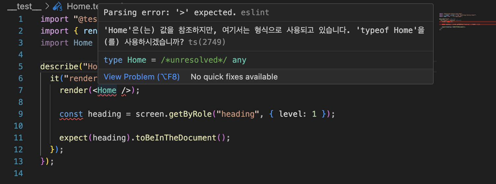

## Contents

진행하는 개인프로젝트에서 test를 진행하려고 하면서 겪었던 jest설치 과정 트러블 슈팅입니다.

# 공식문서에 나와있는대로 진행

https://nextjs.org/docs/app/building-your-application/testing/jest

```bash
npm install -D jest jest-environment-jsdom @testing-library/react @testing-library/jest-dom
```

and

```bash
npm init jest@latest
```


근데 공식문서를 보면 다음에 jest.config.ts를 다음과 같이 설정하라고 나와서 크게 의미가 있는지는 모르겠습니다.

```tsx
import type { Config } from "jest";
import nextJest from "next/jest.js";

const createJestConfig = nextJest({
  // Provide the path to your Next.js app to load next.config.js and .env files in your test environment
  dir: "./",
});

// Add any custom config to be passed to Jest
const config: Config = {
  coverageProvider: "v8",
  testEnvironment: "jsdom",
  // Add more setup options before each test is run
  // setupFilesAfterEnv: ['<rootDir>/jest.setup.ts'],
};

// createJestConfig is exported this way to ensure that next/jest can load the Next.js config which is async
export default createJestConfig(config);
```

package.json에 다음과 같은 코드 추가하면 npm run test를 사용해서 테스트를 진행할 수 있습니다.

```tsx
{
  "scripts": {
    ...
    "test": "jest",
    "test:watch": "jest --watch"
  }
}
```

테스트 파일 작성할때 root경로에 \_\_test\_\_만들어주고 “컴포넌트이름.test.tsx”라고 만들어주면 됩니다.

# case 1. 컴포넌트를 타입으로 인식하는 경우



확장자를 .ts로 지정하면 컴포넌트를 타입으로 인식하기 때문에 에러가 발생합니다 .tsx확장자를 써줍시다.

# case 2. ts-node를 설치해야하는 경우


그리고 **ts-node**(타입스크립트를 노드환경에서도 돌아가게 해주는 라이브러리) 라이브러리 설치해야 타입스크립트 테스트 돌릴 수 있습니다. 경고가 뜨면 설치하면 잘 돌아갑니다.

[npm: ts-node](https://www.npmjs.com/package/ts-node)

# case 3. SyntaxError: '\*[role~="heading"],h1,h2,h3,h4,h5,h6' is not a valid selector

이 글을 적는 시점(2024.04.21)에서 스크린샷을 따기 위해 package-lock.json과 node_modules를 지우고 다시 설치했더니 다음과 같은 오류가 발생했습니다.


그래서 구글에 검색을 돌려도 마땅히 해결책이 없었습니다.

그래서 이전 package-lock.json(2024.04.19 시점)을 가져와서 npm ci를 실행시키니까 또 정상적으로 동작을 했습니다.

몇시간 정도 해결을 해보려고 했는데, 이렇다할 설정을 건드린것도 없어서 vsc에서 package-lock.json의 변경사항을 추적해보고 의존성이 현재 글을 적는 시점과 전 시점 사이에 의존성의 의존성들 중 무언가가 업데이트가 되어서 에러가 발생한게 아닌게 추측을 하고 있습니다.
(추후 업데이트 필요)
