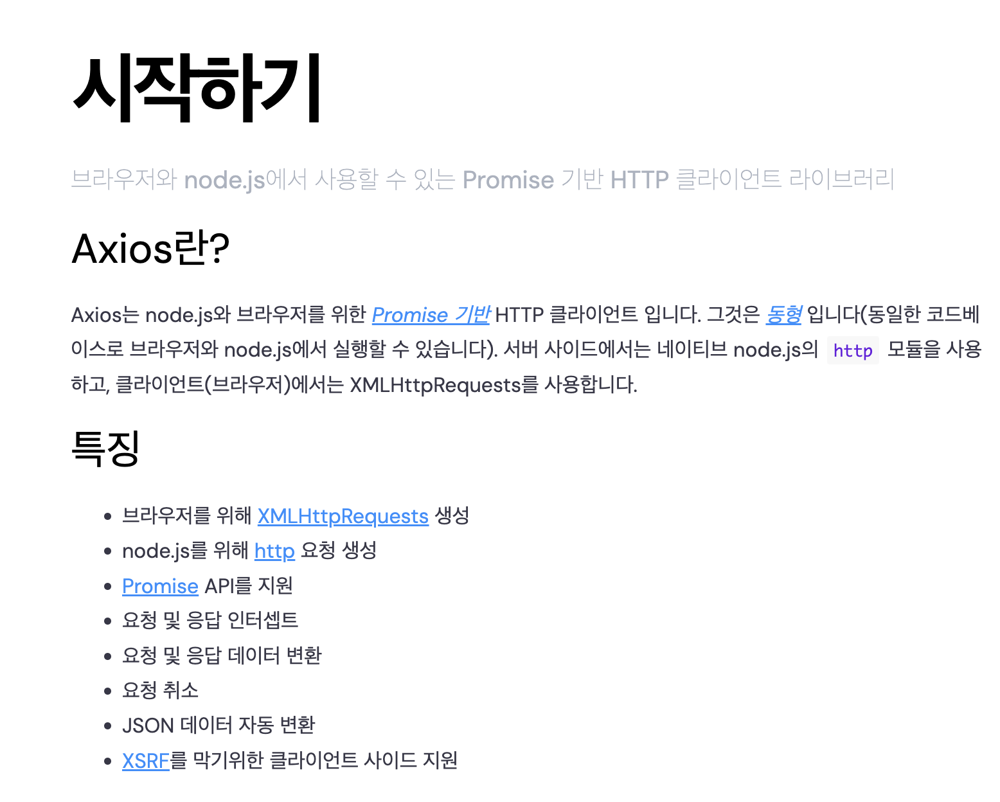

## Contents

# 왜 이걸 하게 됐나요?

일전에 스타트업에 면접을 보러 갔었습니다.

생에 처음 면접을 보는거라 매우 매우 떨렸는데요, 면접관님이 하신 질문중에 다음과 같은 질문이 있었습니다.

> 요청 500개에 대한 일괄적인 처리는 어떻게 할 수 있을까요?

당시에 저는 너무 긴장한 나머지 "요청을 감싸는 함수를 만들어 처리하겠습니다." 라고 대답을 했었습니다.

뒤늦게 면접을 복기해보면서 axios라는 라이브러리에 대한 활용을 바탕으로 대답을 할 걸... 이라는 후회가 들었습니다.

그래서 한번 그때의 대답과 요구사항을 융합(?) 하는 겸, 간단하게 axios의 interceptor를 vanilla JS로 구현해보고자 합니다.


# Axios의 어떤 특성을 가져와서 개발해볼까?

먼저 axios라는 라이브러리가 무엇이고, 왜 사람들이 이걸 쓰는지 간단하게 짚고 넘어가야 할 것 같습니다.

제가 axios를 처음 접했을 때는 단순히 "코드의 가독성이 향상되어서 많이 쓰이는 구나" 라고 생각을 했었습니다.

과연 그럴까요?

예시를 한 번 들어보겠습니다.

다음과 같이 서버에 요청을 보내는 코드가 있다고 가정해보겠습니다.
(예시 서버 : https://koreanjson.com)

이는 다음과 같이 표현될 수 있습니다.

```js
// XMLHttpRequest
const xhr = new XMLHttpRequest();
xhr.open("GET", "https://koreanjson.com/users", true);

xhr.onload = function () {
  if (xhr.status >= 200 && xhr.status < 300) {
    console.log(JSON.parse(xhr.responseText));
  } else {
    console.error("Request failed with status: " + xhr.status);
  }
};

xhr.onerror = function () {
  console.error("Request failed");
};

xhr.send();

// Fetch API
fetch("https://koreanjson.com/users")
  .then(function (response) {
    if (!response.ok) {
      throw new Error("Network response was not ok");
    }
    return response.json();
  })
  .then(function (data) {
    console.log(data);
  })
  .catch(function (error) {
    console.error("Fetch error: " + error.message);
  });

// Axios
import axios from "axios";

axios
  .get("https://koreanjson.com/users")
  .then(function (response) {
    console.log(response.data);
  })
  .catch(function (error) {
    console.error(error);
  });
```

모두 같은 결과를 콘솔에 출력하게 되는데요, 뭔가 간결해서 쓴다라고 하기에는 XMLHttpRequest를 제외하면 나머지 둘은 차이가 없어 보입니다.

Post 요청의 경우도 마찬가지인 것 같은데요,

```js
//Fetch API
fetch(url, {
  method: "POST",
  headers: {
    "Content-Type": "application/json",
  },
  body: JSON.stringify(data),
});

// Axios
axios({
  method: "post",
  url: "/user/12345",
  data: {
    firstName: "Fred",
    lastName: "Flintstone",
  },
});
```

이 경우에도 headers의 여부와 약간의 방식적인 차이만 존재하지 딱히 크게 불편함을 느끼지는 못하겠습니다.

하지만, 위의 XMLHttpRequest와 Fetch API는 Node.js 환경에서는 사용할 수 없는데요,

axios는 **Node.js에서도 그대로 사용**할 수 있다는 점이 장점으로 작용합니다.

node.js에서도 돌아가고 브라우저에서도 사용 가능하니 개발자가 번거롭게 신경을 쓰지 않아도 되는 것이죠.

개인적으로 이러한 특성은 SSR이나 SSG가 대세가 되는 흐름에서 유용해보입니다.

그 밖에도 몇몇 이유가 있습니다. 공식홈페이지의 설명은 다음과 같습니다.



GPT에게 물어보니 다음과 같은 대답을 해주네요.

<details>
<summary>GPT4에게 물어본 axios를 쓰는 이유</summary>
<div markdown="1">

1. 간편한 구문: Axios는 Promise 기반 API를 제공하여 비동기 HTTP 요청을 간단하고 직관적인 코드로 처리할 수 있게 합니다. 이는 복잡한 콜백 패턴을 피하고, async/await 구문과 잘 어울립니다.

2. 브라우저와 Node.js 지원: Axios는 브라우저와 Node.js에서 모두 사용할 수 있어, 프론트엔드와 백엔드 개발에서 일관된 경험을 제공합니다.

3. 요청과 응답 인터셉터: 요청을 보내기 전이나 서버로부터 응답을 받은 후에 데이터를 가로채서 수정하거나 추가 작업을 수행할 수 있는 기능을 제공합니다. 이는 API 호출의 공통적인 사전 처리나 사후 처리 로직을 구현하는 데 유용합니다.

4. 요청 취소: 진행 중인 요청을 취소할 수 있는 기능을 제공합니다. 이는 사용자 인터랙션 또는 네트워크 상태에 따라 불필요한 네트워크 활동을 줄이는 데 도움이 됩니다.

5. 자동 JSON 변환: 서버로부터 받은 응답을 자동으로 JSON 형태로 변환해줍니다. 이는 추가적인 파싱 로직을 구현할 필요를 없애줍니다.

6. 클라이언트 측 보안 지원: CSRF(Cross-Site Request Forgery)와 같은 웹 보안 이슈에 대응하기 위한 기능을 포함하고 있습니다.

</div>
</details>

제가 면접에서 대답한 질문의 답인 "어떤 함수로 감싼다"라는 맥락에서는 node 환경과 브라우저 환경 모두에서 동작하는게 중요해보입니다.

따라서 **node.js와 브라우저 환경에서 잘 돌아가고, 인터셉터 기능이 추가**된 뭔가를 만들어야겠습니다.

# XMLHttpsRequest를 사용할까 Fetch API를 사용할까

우선 서버에 요청을 보내는 내장 api를 사용해야겠습니다.

Node.js의 경우에는 자체적으로 제공하는 https 모듈을 가져오면 되지만, 브라우저에서는 두가지의 선택지가 남게 되는데요,

XMLHttpRequest와 Fetch API 중 선택을 해야 하겠습니다.

XMLHttpRequest와 Fetch API는 다음과 같은 차이를 나타냅니다.

|        | XMLHttpRequest                                                                                       | Fetch API                                                                                                               |
| ------ | ---------------------------------------------------------------------------------------------------- | ----------------------------------------------------------------------------------------------------------------------- |
| 호환성 | 오래 전부터 사용되어 온 방식으로, 초기 AJAX 통신을 가능하게 함. 대부분의 브라우저에서 넓게 지원됨.   | 비교적 새로운 API로, Promise를 기반으로 함. 일부 구형 브라우저에서는 폴리필이 필요함.                                   |
| 사용법 | 복잡하고 세부적인 설정이 가능. 이벤트 리스너를 통해 요청의 생명주기를 세밀하게 관리할 수 있음.       | Promise 객체를 반환하며, async/await 구문과 함께 사용하기 좋음. 간결한 구문을 제공함.                                   |
| 기능   | 기본적인 AJAX 통신 기능 제공.                                                                        | CORS와 HTTP/2 지원, 스트림을 사용한 응답 본문의 비동기 처리 가능, Service Worker와의 통합으로 PWA 개발에 이점 제공.     |
| 단점   | 낮은 수준의 API로, 많은 코드가 필요하며, 현대적인 JavaScript 비동기 패턴과 자연스럽게 연결되지 않음. | IE를 포함한 일부 구형 브라우저에서 지원되지 않음. 요청 타임아웃 설정이 없으며, 네트워크 실패가 아닌 경우 거부되지 않음. |
|        |

axios는 프로미스를 지원하고, XMLHttpRequest 자체의 학습이 목적이 아님으로 Fetch API를 사용해보도록 하겠습니다.
